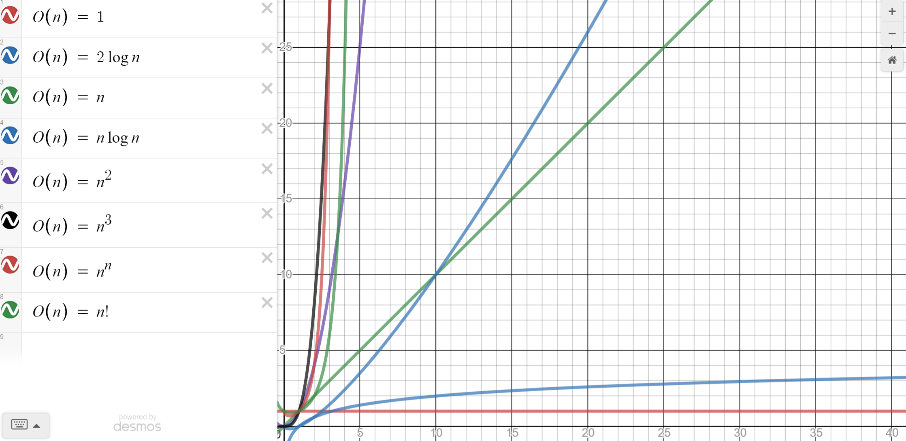

자료구조
-

자료구조를 사용하는 목적
-
대량의 데이터를 효율적으로 관리하기 위함 (찾고 입력할 때)

ex) 배열, 스택, 큐, 링크드 리스트, 해쉬테이블 등등

알고리즘을 배우는 목적
-
알고리즘이란?
   - 문제 풀이를 위한 절차/방법 
   - 입력을 받아 출력하는 과정을 조절하는 것

ex) 요리 레시피

좋은 알고리즘이란?  
   - 시간, 작은 공간(메모리)을 차지하는 알고리즘
---

자료구조
-
* [배열](./src/com/array/array.md "배열")
* [큐](./src/com/queue/queue.md "큐")
* [스택](./src/com/stack/stack.md "스택")
* [링크드리스트](./src/com/linkedlist/LinkedList.md "링크드리스트")
* [해시테이블](./src/com/hashtable/HashTable.md "해시테이블")
* [트리](./src/com/tree/tree.md "트리")

비교표
-


비교 실험
-
1. [LinkedList VS ArrayList](./src/com/speedTest/ListSpeedTest.md "LinkedList VS ArrayList")


알고리즘 공부가 왜 필요한지?
-
문제를 푸는 방법은 다양하기 때문에 같은 문제라도 방법에 따라 걸리는 시간이 천차만별임. 더 좋은 방법을 판별하고 만들기 위해 알고리즘 공부가 필요

ex) 정수의 절대값 구하기 
* >$$
  >\sqrt{x^2}
  >$$ 
* x < 0 ? -x : x


알고리즘의 성능 측정 기준
-
1. 시간복잡도: 알고리즘의 실행속도 => 주로 반복문의 사용이 많은 영향을 미침
2. 공간복잡도: 알고리즘이 사용하는 메모리 사이즈

알고리즘의 성능 표기법
-
1. Big-O 표기법: O(n) => 최악의 경우 실행시간(가장 일반적, 최소 이정도 성능은 보장한다는 의미)
2. Ω 표기법 (오메가): Ω(n) => 최고실행시간
3. θ 표기법 (세타): θ(n) => 평균 실행시간

Big-O 표기법
-
n을 입력하는 양이라고 가정할 때 O(n)으로 표현.  
이 때 n은 매우 큰 값이라고 가정할 때 계산식에서 유의미한 값 만을 취급함

ex)
O(1), O(log n), O(n), O(n log n), O(n^2), O(2^n), O(n!) 순서로 좋은 알고리즘

예시 O(1)
-
* 무조건 10회 실행. 무조건 1회 실행
```java
if (n > 10) {
    System.out.println(n)
}
```
작업양인 n이 아무리 늘어도 n은 한번만 실행됨. 따라서 O(1). 10회 실행같이 고정된 실행회수는 동일하게 O(1)


예시 O(n)
-
```java
for (int i=0; i<n; i++) {
    System.out.println(i);
}
```
* 실행 회수가 3n+10, n+7... 등으로 표현되는 것은 모두, n이 무한대로 큰 수라고 가정했을 때 오직 n만이 의미있는 숫자이기 때문에 O(n)  
* 마찬가지로 3*n^2, n^2+100 모두 O(n^2)으로 표기




 

