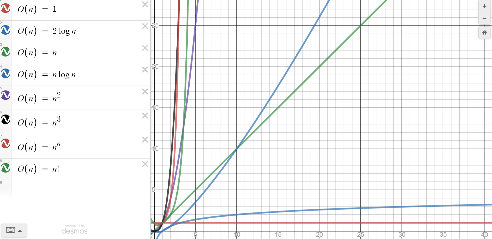

자료구조
-

자료구조를 사용하는 목적
-
대량의 데이터를 효율적으로 관리하기 위함 (찾고 입력할 때)

ex) 배열, 스택, 큐, 링크드 리스트, 해쉬테이블 등등

알고리즘을 배우는 목적
-
알고리즘이란?
   - 문제 풀이를 위한 절차/방법 
   - 입력을 받아 출력하는 과정을 조절하는 것

ex) 요리 레시피

좋은 알고리즘이란?  
   - 시간, 작은 공간(메모리)을 차지하는 알고리즘
---

배워야할 것 목차
-
* 정렬
    - 버블정렬
    - 선택정렬
    - 삽입정렬
    - 퀵정렬
    - 병합정렬 
    - 힙정렬
    - 문자열정렬
    - 계수정렬
* 자료구조
    - 스택
    - 큐
    - 링크드리스트
    - 해시테이블
    - 트리 (이진트리)
    - 힙
    
* 탐색 알고리즘
    - 너비 우선 탐색
    - 깊이 우선 탐색
    - 합 집합 찾기
    - 크루스칼 알고리즘
    - 순회 알고리즘

* 고급 알고리즘
    - 다이나믹 프로그래밍 (분할 정복 기법에서 한번만 풀도록 하는 알고리즘)
    - 타일링 (사각형을 특정 모양 사각형으로 채우는 방법의 경우의 수)
    - 에라토스테네스의 체 (소수를 판별하는 알고리즘) 
    - 다익스트라 알고리즘 (최단 경로 알고리즘, 인공위성 GPS 소프트웨어 등에서 많이 사용)
    - 플로이드 와샬 알고리즘 (최단 경로 구하는 알고리즘 2)
    - 위상 정렬 알고리즘 (순서가 정해진 작업을 차례로 수행해야할 때 사용하는 알고리즘)
    - 강한 결합 요소 (SCC 알고리즘)
    - 네트워크 플로우 (특정 지점에서 다른 지점으로 얼마나 많은 데이터가 흐르는지 측정하는 알고리즘, 교통 체증 등등에 사용)
    - 이분 매칭 (네트워크 플로우 알고리즘 중 하나)
    - 단순 문자열 매칭 알고리즘 
    - KMP 문자열 매칭 알고리즘 (문자열 검색 알고리즘)
    - 라빈 카프 (Rabin-Karp) 알고리즘
    - 그라디 알고리즘 (눈 앞에 보이는 최적의 상황만을 쫒는 알고리즘)

자료구조
-
* [배열 (Array)](src/com/dataType/array/README.md "배열")
* [큐 (Queue)](src/com/dataType/queue/README.md "큐")
* [스택 (Stack)](src/com/dataType/stack/README.md "스택")
* [링크드리스트 (Linkedlist)](src/com/dataType/linkedlist/README.md "링크드리스트")
* [해시테이블 (Hashtable)](src/com/dataType/hashtable/README.md "해시테이블")
* [트리 (Tree)](src/com/dataType/tree/README.md "트리")
* [힙 (Heap)](src/com/dataType/heap/README.md "힙")

알고리즘
-
* [정렬 (Sort)](src/com/algorithm/sort/README.md "정렬")
* [재귀호출 (recursive)](src/com/algorithm/recursive/README.md "재귀호출")
* [탐색 (search)](src/com/algorithm/search/README.md "탐색")


비교표
-


비교 실험
-
1. [LinkedList VS ArrayList](src/com/dataType/speedTest/README.md "LinkedList VS ArrayList")


알고리즘 공부가 왜 필요한지?
-
문제를 푸는 방법은 다양하기 때문에 같은 문제라도 방법에 따라 걸리는 시간이 천차만별임. 더 좋은 방법을 판별하고 만들기 위해 알고리즘 공부가 필요

ex) 정수의 절대값 구하기 
* >$$
  >\sqrt{x^2}
  >$$ 
* x < 0 ? -x : x


알고리즘의 성능 측정 기준
-
1. 시간복잡도: 알고리즘의 실행속도 => 주로 반복문의 사용이 많은 영향을 미침
2. 공간복잡도: 알고리즘이 사용하는 메모리 사이즈

알고리즘의 성능 표기법
-
1. Big-O 표기법: O(n) => 최악의 경우 실행시간(가장 일반적, 최소 이정도 성능은 보장한다는 의미)
2. Ω 표기법 (오메가): Ω(n) => 최고실행시간
3. θ 표기법 (세타): θ(n) => 평균 실행시간

Big-O 표기법
-
n을 입력하는 양이라고 가정할 때 O(n)으로 표현.  
이 때 n은 매우 큰 값이라고 가정할 때 계산식에서 유의미한 값 만을 취급함

ex)
O(1), O(log n), O(n), O(n log n), O(n^2), O(2^n), O(n!) 순서로 좋은 알고리즘

예시 O(1)
-
* 무조건 10회 실행. 무조건 1회 실행
```java
if (n > 10) {
    System.out.println(n)
}
```
작업양인 n이 아무리 늘어도 n은 한번만 실행됨. 따라서 O(1). 10회 실행같이 고정된 실행회수는 동일하게 O(1)


예시 O(n)
-
```java
for (int i=0; i<n; i++) {
    System.out.println(i);
}
```
* 실행 회수가 3n+10, n+7... 등으로 표현되는 것은 모두, n이 무한대로 큰 수라고 가정했을 때 오직 n만이 의미있는 숫자이기 때문에 O(n)  
* 마찬가지로 3*n^2, n^2+100 모두 O(n^2)으로 표기




알고리즘 연습 방법
-
1. 알고리즘 문제를 읽고 분석하기
2. 간단하게 매우 간단한 경우부터 복잡한 경우 순서대로 생각하며 노트에 작성해가며 생각해본다.
3. 가능한 알고리즘이 보인다면 구현할 알고리즘을 세부 항목으로 나누고, 문장으로 세부 항목을 나누어서 적어본다.
4. 코드화 하기 위해 데이터 구조 또는 사용할 변수를 정리
5. 데이터 구조 또는 사용할 변수가 코드에 따라 어떻게 변하는지 손으로 적으면서 임의 데이터로 코드가 정상 동작하는지를 검증한다.


 


공간복잡도
-
시간복잡도와 공간복잡도를 둘다 만족시키는 것은 어려움
* 시간과 공간은 반비례적 경향이 있음
* 최근 대용량 시스템이 보편화되면서, 공간 복잡도 보다는 시간 복잡도가 우선 => 그래서 중심

공간복잡도의 계산
-
* 기존 알고리즘 문제는 예전에 공간 복잡도도 고려되어야 할 때 만들어진 경우가 많음
* 그래서 기존 알고리즘 문제에 시간 복잡도 뿐만 아니라, 공간 복잡도 제약 사항이 있는 경우가 있음
* 또한 기존 알고리즘 문제의 영향을 받아서 면접시에도 공간 복잡도를 묻는 경우도 있음
* 현업에서 최근 빅데이터를 다룰 때는 저장 공간을 고려해서 구현하는 경우도 있음

공간복잡도란?
-
* 프로그램을 실행 및 완료하는데 필요한 저장공간의 양을 뜻함
* 총 필요 저장 공간
   - 고정 공간 (알고리즘과 무관한 공간): 코드 저장 공간, 단순 변수 및 상수
   - 가변 공간 (알고리즘 실행과 관련이 있는 공간): 실행 중 동적으로 필요한 공간 
   - 계산법: 공간복잡도 = 가변공간 + 고정공간 / 가변공간에 의해 주로 좌우됨
   
재귀용법 (재귀호출)
-
* 고급 정렬 알고리즘에서 재귀용법을 많이 사용하기 때문에 고급 정렬 알고리즘을 익히기 전에 재귀 용법을 먼저 익힌다.


알고리즘에 대한 더 자세한 설명 
-
[알고리즘](./src/com/algorithm/README.md)
