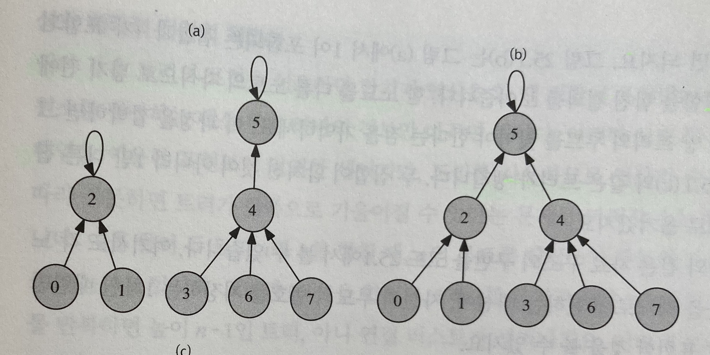
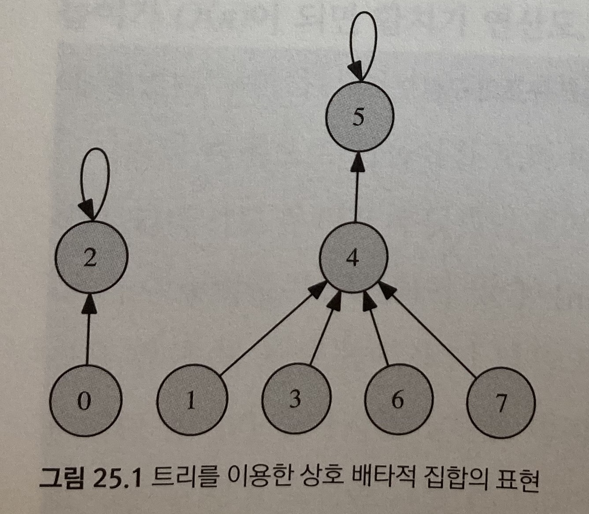
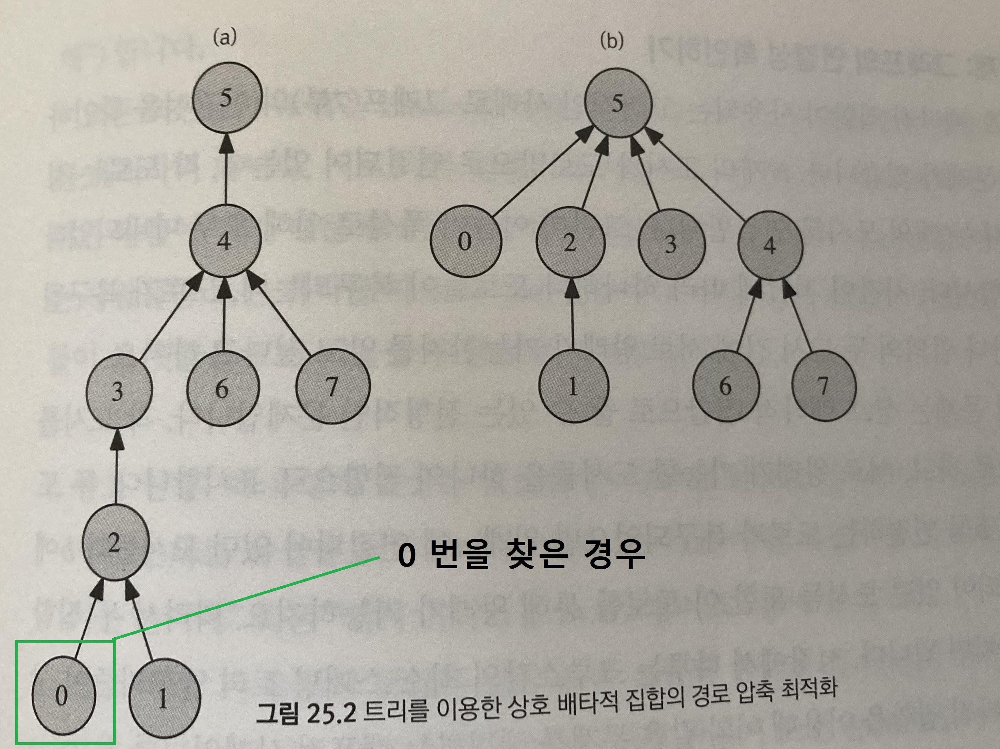

상호 배타적 집합
-
* 상호 배타적 집합(disjoint set)을 표현할 때 쓰는 유니온-파인드(Union-Find) 자료 구조
* 기존의 트리와는 상당히 다른 구조로 되어 있음
    * 트리란?  
        * 그래프의 일종으로, 여러 노드가 한 노드를 가리킬 수 없는 구조이다. 
        * 간단하게는 회로가 없고, 서로 다른 두 노드를 잇는 길이 하나뿐인 그래프를 트리라고 부른다.
        * DAG 그래프의 한 종류.
        
* 두개 이상의 집합에 속할 수 없는 원소를 여러개로 집합으로 쪼갠 것

* 3가지 연산을 통해서 구현할 수 있음
    1. 초기화 : n개의 원소가 각각의 집합에 포함되어 있을 수 있도록 초기화 합니다.
    2. 합치기 연산 : 두 원소 a,b가 주어질 때, 이들이 속한 두 집합을 하나로 합침
    3. 찾기 연산 : 어떤 원소 a가 주어질 때 이 원소가 속한 집합을 반환
    * 합치기 & 찾기 두 연산을 지원한다고 해서 유니온-파인드(union-find) 자료 구조라고 부릅니다.

* 상호 배타적 집합을 표현하는 2가지 방법
    1. 배열로 상호 배타적 집합 표현하기
        * 1차원 배열 belongsTo 가 있을 때 belongsTo[i] = i번 원소가 속하는 집합의 번호
        
        => 찾을 때는 O(1)의 시간 복잡도를 가지지만, 합치기 연산이 오래걸림(배열은 원소의 위치가 바뀌만 나머지 원소의 위치도 바꿔줘야 하기 때문)
    2. 트리를 이용한 상호 배타적 집합의 표현 
        * 한 집합에 속하는 원소들을 하나의 트리로 묶어주는 것
        * 따라서 배타적 집합 자료 구조는 트리들의 집합으로 표현 됨

 

📌 원소의 확인
-
* 두 원소가 같은 트리에 속해 있는지 확인하는 방법
    1. 원소가 포함된 트리의 루트를 비교하는 방법 => 같은 원소라면 같은 트리에 속해 있는 것
    2. 이와 같은 연산을 위해서, 모든 자식 노드가 부모에 대한 포인터를 가지고 있어야함
        * 반대의 경우는 찾아갈 일이 없기 때문에, 부모는 자식 원소에 대한 포인터를 가지고 있을 필요가 없음
        * 루트 원소의 경우 포인터로 자기 자신을 가리키고 있으면 된다.

 

📌 원소 합치기
-
* 각 트리의 루트를 찾은 뒤에, 하나를 다른 한쪽의 자손으로 넣으면 됨.
* 루트를 꼭 찾지 않고 아무 원소나 찾아서 이어 놓으면, 집합이 여러개로 분리된다는 점 주의하기

 

📌 최적화
-
* 노드의 find 시간 단축을 위해, 트리 높이가 높아지는 것을 막기
    * 최악의 경우 모든 노드가 일렬로 나열 되어 find 하는데, O(n)의 시간 복잡도를 가지게 될 수 있다.
    * 위 같은 일을 방지하기 위해 별도로 rank 라는 높이를 저장하는 배열을 만들고, merge 할 때 낮은 높이의 트리를 높은 트리의 자손으로 포함시키는 방법이 있다.
    * 위와 같은 처리로, 기존에 h 높이를 만들기 위해 n 개의 노드가 필요했다면, h+1 의 높이를 만들기 위해선 2n개가 필요하다. => 시간 복잡도가 O(log n)

* find 할 때, 모든 노드가 대표노드(맨 위 노드)를 바라보게 하는 방법
    * 재귀 호출을 이용해서 find를 구현했기 때문에, 재귀 호출로 찾은 모든 노드가(찾은 노드의 부모 노드 부터 바라보는 방향이 바뀜!), 대표노드를 바라보게 할 수 있다.
    * 한번 호출 된 노드는 find시 O(1)의 시간 복잡도를 가진다.
    
* 위 두가지 최적화를 적용했을 때, 시간 복잡도를 계산하기 어려운데
* find와 merge를 아주 여러번 할 때 각 수행에 걸리는 평균 시간은 O(a(n))이다. 이때 a(n)은 애커만 함수로 불리는 식으로 상상할 수 없는 큰 수를 넣어도 보통 5를 넘지 않는 수이다.
* 따라서 O(1) 정도로 봐도 무방하다.

 

📌 풀 수 있는 문제
-
* 그래프 연결성 확인하기
    * N개의 도시가 있고 각 도시 사이를 간선으로 연결할 때, 두 도시 사이에 왕래가 가능한지 => 도시가 연결 될 때마다, 같은 집합에 포함시키면 됨

* 가장 큰 집합 추적하기
    * 집합에 속한 원소의 개수를 추적할 수 있음
    * merge 할 때, rank 에 높이를 담는 것 대신에 size를 담으면 그만 => 가장 큰 집합이 어떻게 변하는지 추적 관찰하는 것 가능
