탐색
-

📌 그래프
-

    
펼쳐보기

* 현실 세계의 사물이나 추상적인 개념 간, 연결관계로 표현한 것 
    * ex) 도시간 도로망, 사람 간 지인관계, 웹 사이트간 링크 관계
* 트리와 달리 제약이 없어서 훨씬 다양한 구조를 표현할 수 있어서 현실 세계의 문제를 푸는데 유용하게 사용됨
* 프로그래밍 대회에서도 자주 출제되는 문제임

그래프 정의 [ G(V, E) ]
-
* 어떤 자료나 개념을 표현하는 정점(V, vertex)들의 집합과 이들을 연결하는 간선(E, edge)들의 집합으로 구성된 자료
* 쉽게 점에 선이 연결된 그래프임. 같은 그래프란, 모든 같은 정점간의 연결 관계가 같음을 의미

그래프 종류
-
* 표현하고자 하는 대상에 따라 여러가지 변형된 형태를 가짐 
* 정점이나 간선에 속성 부여할 수 있고, 존재할 수 있는 간선이나 정점의 형태에 제약을 두기도 함
    1. 유향 그래프 (directed graph)
        * 대표적인 방향 그래프 중 하나, 간선이 방향이라는 속성을 가짐
        
        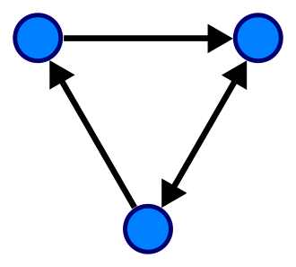
        * 현실 세계에서 사람들과 짝 사랑관계, 도로망에서의 일반 통행 등이 해당
        * 반대되는 그래프를 무향 그래프라고 부름
        
    2. 가중치 그래프 (Weighted graph)
        * 간선에 가중치라고 불리는 실수 속성이 부여된 그래프
        
        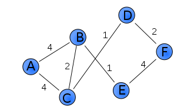
        * 가중치는 두 도시 사이 거리, 두 물건 사이의 교환 비율, 두 사람 사이 호감도 등, 다양한 정보를 표현하는데 사용 가능 
        * 최소 스패닝 트리(모든 정점을 포함하는 최단 경로) 문제나 퇴단 경로 문제 등이 가중치 그래프로 풀 수 있는 문제
        
    3. 다중 그래프 (Multi pseudograph)
        * 두 정점 사이 2개 이상의 간선이 있을 수 있는 그래프
        
        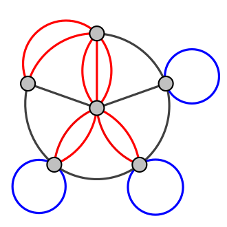
        * 도로망 같은 경우가 대표적인 예시 
        * 두 정점사이 최대 한개의 간선만 있는 그래프는 단순 그래프 라고 부름 

    4. 트리 (tree)
        * 두 노드 간 간선은 무조건 하나 밖에 없는 그래프
        
        
        * 고로, 간선들의 연결 관계가 트리 같다는 말은 두 정점사이 그래프가 딱 하나라는 말 
        
    5. 이분 그래프(complete bipartite graph)
        * 정점이 두개의 그룹으로 나뉘어서, 같은 그룹간에 간선은 존재할 수 없는 그래프
        
        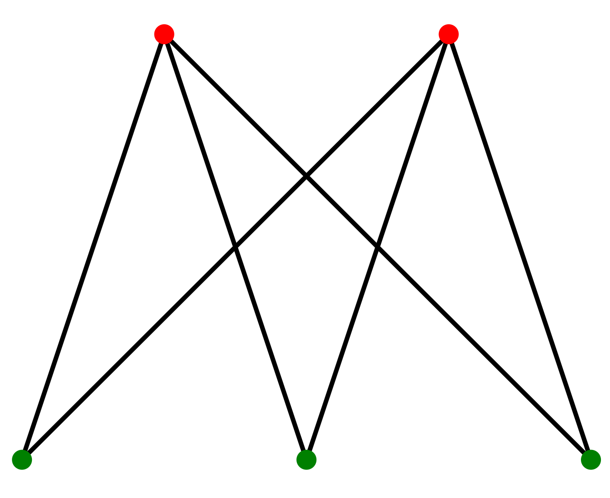
        * 서로 다른 그룹(빨강-초록, 또는 초록-빨강)에 속한 정점들 간에만 간선이 존재할 수 있음
    
    6. 유향 비순환 그래프 (directed acyclic graph, DAG)
        * 위에서 언급한 속성 중, 두가지 이상이 포함된 그래프의 대표적인 예시
        
        
        * 방향을 가지고 출발한 정점으로 돌아오는 경로(사이클)가 없는 그래프 
        * 간선의 방향을 무시한다면 이미 그것은 DAG가 아님을 주의깊게 봐야함

 
    

그래프의 경로
-
* 끝과 끝이 서로 연결된 간선들을 순서대로 나열한 것 
* 방향 그래프의 경우 앞 간선의 끝과 뒷 간선의 시작점이 만나야함 (화살표의 머리가 마주보거나, 뒤돌아 있는경우는 경로가 아니라는 말)
* 경로 중 정점을 최대 1번만 지나는 경로를 **단순 경로**라고 부름 => 사실상 현대 그래프 이론에서의 경로
* 시작한 점에서 끝나는 경로를 사이클(회로)라고 부름

 

그래프 사용 예
-

* **철도망의 안정성 분석**
    * 한 역이 폐쇄되어 열차가 못 지날 경우, 철도망 전체가 두개로 쪼개질 가능성이 있는지 찾을 때, 절단점 찾기 알고리즘을 사용함 
    
    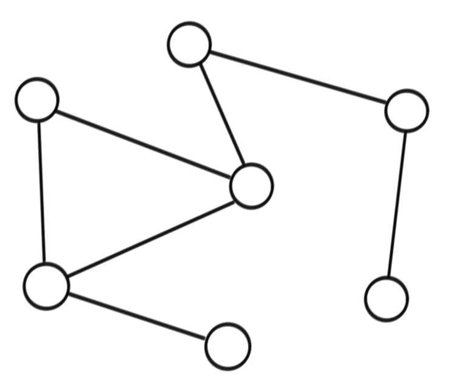
    * 절단점에 해당하는 정점을 삭제할 경우 경로가 아예 2개로 나뉘어버림
    
    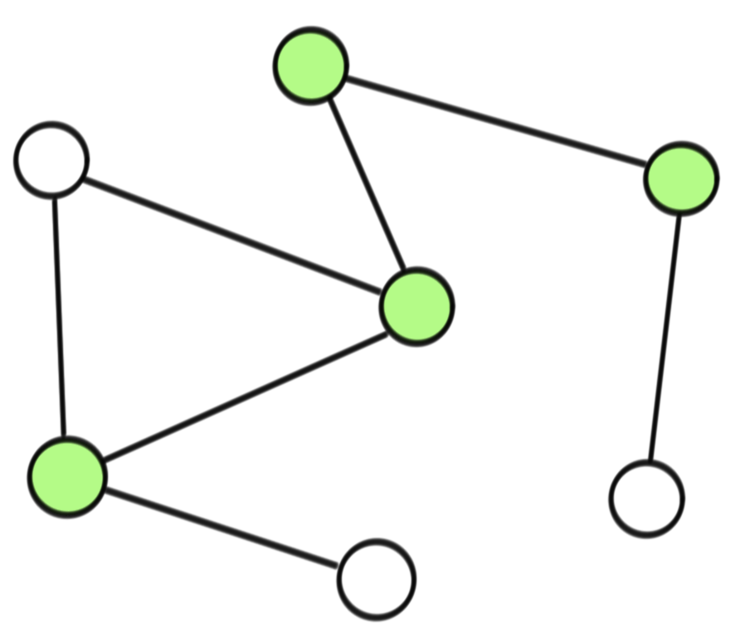
    * 초록색에 해당하는 정점이 절단점

* **소셜 네트워크 분석**
    * 사람들 간의 지인/친밀도 관계를 그래프로 표현 가능
    * 이 때 해당 그래프의 너비 우선 탐색을 이용하면 한 다리 건너 알고있는 사람은 몇명이나 되는지, 몇 다리를 건너야 특정 사람과 내가 아는 사이가 되는지 쉽게 알 수 있음 

* **인터넷 전송 속도 계산**
    * 컴퓨터와 라우터들이 네트워크로 연결되어 있는 관계 또한 그래프
    * 보통 경로에 존재하는 제일 작은 전송용량을 가진 케이블에 의해 **인터넷 전송 속도**가 좌우됨
    * 이때는 최소 스패닝 트리 알고리즘으로 문제를 풀 수 있음
* **한 붓 그리기**
    * 모든 선을 한번만 지나는 경로
    * 오일러 경로라고 부르며 **깊이 우선 탐색**을 응용해서 풀이 가능
* **외환거래**
    * 외환 거래 후 다시 원래 돈(원화,달러,엔화 등)으로 거래했을 때 환율 차이 때문에 생기는 이익을 아비트러지라고 함
    * 각 통화를 정점이라고 가정하고, 교환 가능한 통화들 사이를 간선이라고 하고 환율을 가중치라고 하면 그래프 문제가 됨.
    * 각 경로에 놓인 가중치를 모두 곱했을 때 1을 초과하는 값이 되는 길을 찾으면 되는 것
    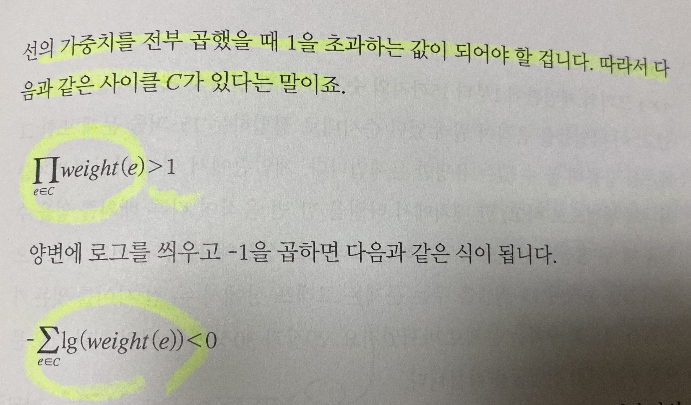
    * (사진의 계산식을 볼 때) 결과적으로 최단 거리 알고리즘을 이용하면 가중치의 합이 음수인 사이클을 쉽게 찾을 수 있음

암시적 그래프 구조들
-
그래프는 아니지만, 그래프 처럼 변환해서 풀 수 있는 문제들

* 할일 목록 정리하기
    1. 외출을 하려면 외출 복을 입어야함
    2. 외출복을 입으려면 빨아야함
    3. 빨려면 세제가 필요함 
    * 각각의 목록이 의존관계이ㅔ 있음. 한번에 하나씩 해 나갈 방법이 있는지 있다면 어떤 순서로 하면 되는지는 **위상 정렬/깊이 우선 탐색의 일종**을 이용해서 풀 수 있음

* 15퍼즐
    * 4 곱하기 4 크기 퍼즐에 15개의 타일을 움직여 제자리에 맞춰가는 문제.
    * 타일의 위치를 정점이라고 하고, 타일을 움직일 때 정점 사이를 연결하는 것이라고 가정하면, 모든 타일의 제위치로의 최단 경로를 찾는 문제로 바뀜

* 게임판 덮기
    * 가로 N칸, 세로 N칸 정사각형 게임판에 1 곱하기 2크기의 블록으로 채우는 문제. 이때 채울 수 없는 칸이 존재 + 블록끼린 겹치면 안됨 
    * 모든 칸에 블록을 놓을 수 있는 방법이 있는지 찾는 문제
    * 막히지 않은 각 칸을 정점으로 하고, 상하좌우로 인접한 칸들 사이에 간선을 연결하는 그래프 => 이분 그래프라고 할 수 있음
    * 따라서 이분 매칭 알고리즘으로 풀어야함

* 회의실 배정 
    * N개의 팀이 회의를 하려는데 회의실은 하나. 
    * 각각의 팀이 사용하고 싶은 희망 시간대를 2개 씩 적어 냄. 
    * 한번에 한팀만 회의실을 사용하고 중간에 끊어서 사용할 수 없다고 가정할 때, 이런 문제를 만족성 문제(2-SAT)라고 부름
    * 문제를 그래프에서 강 결합성 문제로 변환해서 푸는 방법이 있음 

 

그래프의 표현 방법
-
1. 연결리스트를 이용한 방법 : 정점을 객체(클래스)로 설정하고 연결 정보(연결 리스트 이용)를 담는 방법
    * 특징 : 추가 삭제가 빈번하지 않을 경우(추가 삭제가 복잡하므로) 사용
    * 장점 : 정점의 수만큼만 노드(인스턴스)를 가지므로 메모리를 적게 먹음
    * 단점 : 추가 삭제가 복잡(구조 변경이 복잡). 추가 삭제하려면 모든 노드를 뒤져봐야하는 불상사가 생김
2. 배열을 이용한 방법 : 정점에 인덱스를 붙이고 각 배열에 정점 정보를 저장하는 방법
    * 특징 : 정점의 주소를 저장하는 대신, 인덱스를 저장함 
    * 장점 : 추가 삭제가 빈번할 때 인덱스에 접근하는 속도가 빨라서 빠름
    * 단점 : 노드 개수와 상관 없이 늘 일정한 공간을 확보해 놓으므로 메모리를 많이 먹음 

📌 연결 리스트를 이용한 방법 (인접 리스트 표현) 
-
* 하나의 배열을 만들고 각각의 배열에 연결리스트(링크드리스트)를 올린다. 그리고 각 링크드 리스트에 인접한 노드 정보를 저장해놓는 방법
* 만약 정점이 각각 속성을 가져야 한다면, 연결 리스트에 들어갈 값을 클래스로 표현하는 것
* 큰 단점은, 두 정점이 주어질 때 연결되어 있는지를 확인하려면 연결 리스트를 모두 뒤져야 한다는 점 => 이를 극복하기 위해서 인접 행렬 표현 방식이 나옴

 

📌 배열을 이용한 방법 (인접 행렬 표현)
-
* 노드의 개수를 n개라고 할 때 n^2 크기의 2차원 배열을 이용해서 간선 정보를 저장함 (2차원 boolean 배열)
* 각각 인덱스를 노드의 번호라고 할 때 i번 노드에서 j번 노드로 연결되었는지 여부를 판단하는 함수 dajacent[i,j] 는 해당 자리의 값이 true인지를 살펴보면 됨

인접 행렬 표현 VS 인접 리스트 표현 
-
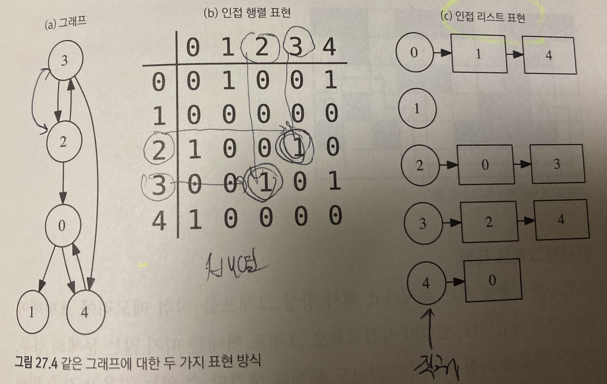

* 간선의 수가 적은 그래프를 희소 그래프라고 하는데, 희소 그래프일 수록 인접 리스트 표현 방식을 사용하는 것이 유리하고 
* 반대로 간선의 수가 많은 것을 밀집 그래프라고 부르는데, 이 때는 인접 행렬 방식을 사용하는 것이 유리하다.

암시적 그래프 표현
-
* 그래프를 이용해서 푸는 문제라고 해서 항상 메모리에 표현을 해야하는 것은 아님.
* 때때로 그래프 처럼 보이지만, 그래프 구조를 직접 사용하지 않고도 해결할 수 있는 문제가 있음
 

* A에서 B로 최단 경로를 찾는 문제라고 생각하면, 그래프를 그리는 것보다, 위 아래 좌우로 인접한 칸이 비어있는지 확인해서 B까지 가면 된다.
* 이런식으로 그래프화 하는데 많은 투자를 할 것 같으면, 이런식으로 그래프를 사용하지 않도로 풀 수 있다.

    

 

 

📌 깊이 우선 탐색
-

    
펼쳐보기

* 트리의 순회와 같이 그래프의 모든 정점들을 특정한 순서에 따라 방문하는 알고리즘
* 탐색 과정에 어떤 간선이 사용 되었는지, 또 어떤 순서로 정점들이 방문되었는지를 통해 그래프의 구조를 알 수 있습니다.
* 그래프의 모든 정점을 발견하는 가장 단순하고 고전적인 방법
    1. 현재 정점과 인접한 간선을 하나씩 검사 후 방문
    2. 더 이상 방문할 곳이 없으면 찾았던 간선을 따라 다시 되돌아감
* 여기서 다루는 탐색 알고리즘은 특정 경로를 찾기 위한 알고리즘이라기보단, 정해진 순서대로 돌러보기 위한 알고리즘
* 지금까지 방문했던 정점들을 모두 저장해둬야 되돌아 갈 수 있으므로 이는 재귀 호출을 이용해서 처리할 수 있음

시간복잡도
-
* 인접 리스트 호출 방식일 때, 모든 노드를 (확인 후) 단 1번만 순회하지만(무향 그래프의 경우 2번), 하나의 노드에 연결 리스트를 쭉 훑어야 하므로 O( V + E )
* 인접 행렬 호출 방식일 때, 2차원 배열의 모든 공간을 훑으므로 O(V^2) 

예제와 실행
-
* [DFS.java](./DFS.java)

예제 1. 두 정점이 서로 연결 되어 있는지 확인하는 방법
-
1. 한 정점에 대해 깊이 우선 탐색 수행 
2. 해당 정점이 방문 된 지점이 맞는지 확인

* 메소드 : [isTwoVertexConnected](./DFS.java#L119)

 

예제 2. 연결된 부분집합의 개수 세기
-
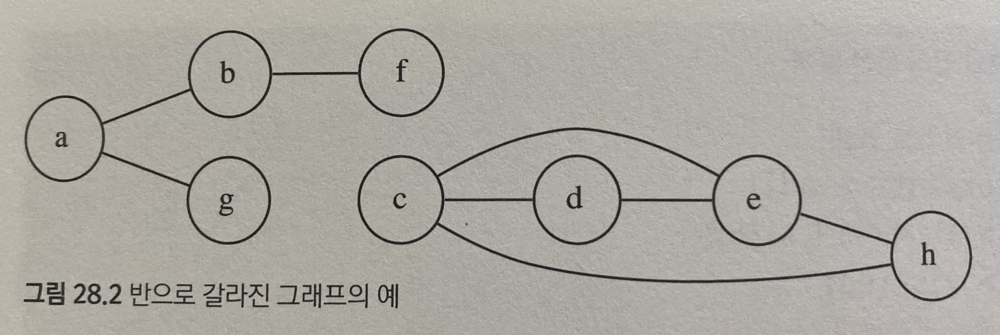
* 끊어진 부분을 컴포넌트 또는 요소라고 하는데 이 요소의 개수를 세는 문제와 같음
* 깊이 우선 탐색을 수행하면 방문한 곳은 true 처리됨. 
* 즉, 모든 정점에 대해 깊이 우선 탐색을 수행할 때 깊이 우선 탐색이 수행된 총 회수를 구하면 됨

* 메소드 : [countSubset](./DFS.java#L143)

 

예제 3. 위상 정렬 (일의 순서를 정렬함)
-
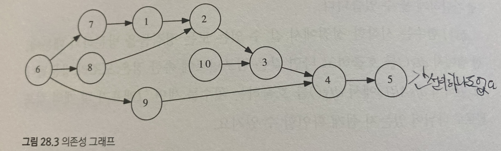
* 위 그래프는 사이클이 없는 DAG 그래프(오직, 사이클이 없고 단방향인 그래프에서만 수행 가능 => 대표적인 예시가 레시피 순서 등이 있음)
* 일의 순서에 번호를 매기면 위와 같은 방식으로 표현 됨

1. 방법 1. 어떤 점에서든 관계 없이 깊이 우선 정렬을 수행해서, 각 정점이 방문 처리 되는 시점을 기록하면 됨 (큐 사용)
    * [countSubset](./DFS.java#L237)
2. 방법 2. 모든 정점을 검사해서 간선이 없는 정점을 먼저 제거하고 그 작업을 반복하면서 지워진 정점을 기록해서 역순으로 나열하는 방법 (스택 사용)
    * [countSubset](./DFS.java#L287)
    

 

📌 너비 우선 탐색
-

    
펼쳐보기

개념 
-
* 시작점에서 부터 가까운 정점부터 순서대로 방문하는 탐색 알고리즘

 

원리
-
1. 각 정점을 방문할 때 마다, 모든 인접 정점 검사
2. 이 중 처음 보는 정점 발견시, 방문 예정이라고 기록 해 둠(큐에 저장)
3. 인접한 정점을 모두 검사한 뒤, 지금까지 저장한 목록에서 다음 정점을 꺼내어 방문
4. 어떤 정점을 먼저 꺼내는 가에 대한 문제이다.

 

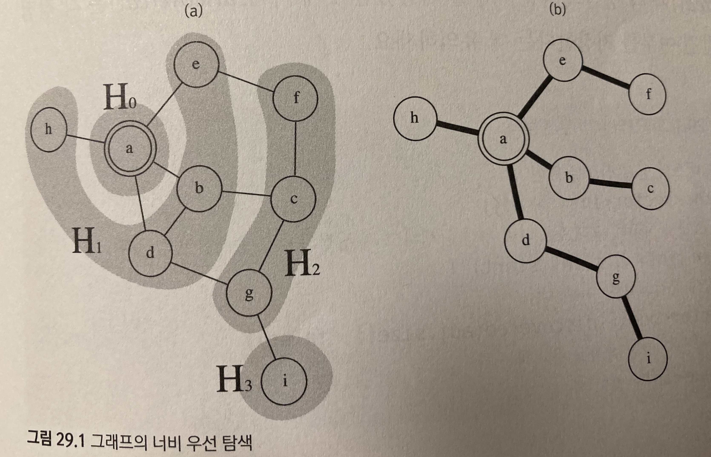

* 너비 우선 탐색이 시작되면 시작점 a를 방문 한 뒤 b, d, e, h가 목록에 추가 됨.
* b,d,e,h 중에서는 어떤 정점이 먼저 방문 되어도 상관 없음. 다만, c는 b,d,e,h가 전부 방문 되기 전까지 결코 방문 되어서는 안됨
* 위와 같은 특성 구현을 위해서 방문 예정인 정점을 저장할 자료 구조료 큐를 사용해서 만족시킬 수 있다.

 

너비 우선 탐색에서 정점의 3가지 상태
-
1. 아직 발견 되기 전 상태
2. 발견 되었으나, 아직 방문 되지는 않은 상태 (큐에는 저장되어 있음)
3. 방문 된 상태

 

📌 그래프 탐색이란
-
* 하나의 정점(node)으로 부터 시작하여 차례대로 모든 정점들을 한 번씩 방문하는 것
* ex) 특정 도시에서 다른 도시로 갈 수 있는지 없는지, 전자 회로에서 특정 단자와 단자가 서로 연결되어 있는지

📌 너비 우선 탐색 (BFS, Breadth First Search)
-
* 루트 노드 또는 임의의 다른 노드에서 시작하여, 인접한 노드를 먼저 탑색하는 방법
    * 시작할 때 가장 가까운 지점을 먼저 방문하고 멀리 떨어진 정점은 나중에 방문하는 순회 방법
    * 즉, 깊게 (deep) 탐색하기 전에 넓게 (wide) 탐색하는 것이다.
    * **두 노드 사이의 최단 경로** 혹은 **임의의 경로를 찾고 싶을 때** 이 방법 선택
        * 지구상에 존재하는 모든 친구관계를 그래프로 표현한 후, 나와 너 사이에 존재하는 경로를 찾고 싶은 경우
            1. 깊이 우선 탐색 : 모든 친구관계를 전부 살펴봐야 할지 모른다.
            2. 너비 우선 탐색 : 나와 가까운 관계부터 탐색한다.

* 특징
    * 재귀 호출로 구현할 수 없다.
    * **어떤 노드를 방문했었는지 여부를 반드시 검사**해야 한다. 그렇지 않으면 무한 루프에 빠질 가능성이 있다.

* 방문한 노드들을 차례대로 저장한 후 꺼낼 수 있는 자료구조인 큐(Queue)를 사용한다. 
    * 선입 선출

* 과정
    1. 깊이가 1인 모든 노드를 방문하고 나서 방문한 노드를 '방문'처리 후 큐에 저장
    2. 다음엔 깊이가 2인 모든 노드를 방문하고 반복
    3. 더 깊은 노드를 탐색하다가 더이상 방문할 곳이 없으면 탐색 종료 후 

1. a 노드(시작노드)를 방문한다. 방문한 a노드는 방문 처리
    * 큐에 a 노드를 삽입 한다.
    * 초기 상태의 큐에는 시작 노드만 저장
2. 큐에서 첫번째 노드 (a)와 인접한 노드들을 모두 차레대로 방문한다.
    * 큐에서 첫번 째 노드와 인접한 노드를 모두 방문한다.
        * 이 때 인접한 노드가 없다면 큐의 가장 앞의 노드를 빼낸다. 
    * 인접한 노드를 찾았을 경우에는 계속 큐에 노드를 삽입한다. 
3. 큐가 모두 소진 될 때까지 계속 한다. 
 

