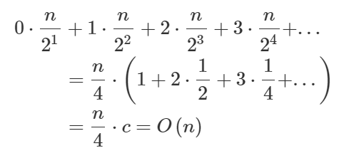

정렬
-

들어가기 전에
-

임의로 배열에 들어갈 값을 추출하는 방법
```java
ArrayList list = new ArrayList<Integer>();
for (int i=0; i<size; i++) {
    int n = (int)(Math.random() * 100) + 1;

    if (!list.contains(n)) {
        list.add(n);
    }
}
for (int i=0; i<list.size(); i++) {
    System.out.print(list.get(i) + ", ");
}
```

출력 결과를 사용해서 배열을 만들고 정렬을 시도하면 됨

---


버블정렬
-
<details>
    <summary>펼쳐보기</summary>

* 가장 먼저 생각해볼 수 있는 알고리즘
* 인접한 두 값을 비교해서 변경해 가며 정렬하는 방법
* 장점 : 구현이 쉽다.
* 단점 : O(n^2) 으로 느린 알고리즘인데다가, 값의 변경이 많아서 느리다. 선택 정렬보다 더 느리다.
* 시간 복잡도 : n * (n-1) / 2 => O(n^2)


* 실행 : [BubbleSort.java](./BubbleSort.java)
</details>


선택정렬
-
<details>
    <summary>펼쳐보기</summary>

* 계속 반복해서 리스트를 반복해서 가장 작은 값을 하나 결정하고 그것을 앞에서 부터 정렬해 넣는 방법 (한번 반복할 때 마다, 다음 반복의 범위가 줄어들음)
* 장점 : 메모리가 제한적일 때 성능상의 이점을 가져갈 수 있다.
* 단점 : 시간복잡도가 O(n^2)으로 좋지 못하나 모든 경우에서 버블 정렬보다는 성능이 좋다.
* 시간 복잡도 : n * (n-1) / 2 => O(n^2)


* 실행 : [SelectSort.java](./SelectSort.java)
</details>


삽입정렬
-
<details>
    <summary>펼쳐보기</summary>

* 정렬하는 범위를 넓혀 가면서 정렬한다. 범위에 들어온 새로운 값을 뒤에서 부터 비교해가며 값을 뒤로 밀어내고, 제자리에 찾아가는 방법이다.
   - 자료 배열의 모든 요소를 앞에서부터 차례대로 이미 정렬된 배열 부분과 비교하여, 자신의 위치를 찾아 삽입함으로써 정렬을 완성하는 알고리즘
* 장점 : 거의 정렬이 되어있는 값을 정렬할 때 상당히 빠르다. (일부 값만을 정렬하므로)
* 단점 : 배열이 길어질수록 효율이 떨어진다
* 시간 복잡도 : n * (n-1) / 2 => O(n ^ 2)


* 실행 : [InsertSort.java](./InsertSort.java)
</details>


퀵정렬
-
<details>
    <summary>펼쳐보기</summary>

* 평균 속도가 O(N+logN)
* logN은 굉장히 작은 숫자
    - 2^10 = 대략 1,000 
    - 2^20 = 대략 1,000,000
    - logN 에서 N 이 1,000,000, 일 때 20 정도
* 특정한 값을 기준으로 큰 숫자와 작은 숫자를 서로 교환한 뒤에 좌우로 배열을 다시 정렬함
* 이때 특정한 기준으로 피벗(pivot)이라고 부름 (보통 가장 앞에 있는 값을 피벗으로 설정)
    1. 피벗을 기준으로 좌측에서 출발해서 핏보다 큰 값을 찾고 
    2. 우측에서 시작해서 피벗보다 작은 값을 찾는다.
    3. 둘이 인덱스가 엇갈렸으면 시작값과 피벗값을 가꾸고 그렇지 않으면 인덱스에 해당하는 두 값을 교환
    4. 피벗을 기준으로 나뉜 좌우 두 배열의 시작, 끝 값으로 재귀호출을 2번 실행


* 실행 : [QuickSort.java](./QuickSort.java)
</details>


병합정렬
-
<details>
    <summary>펼쳐보기</summary>

* 정의 : 반으로 나누다가 그 크기가 1이 되면 병합을 시작. 반씩 정렬한다.
과정은 아래 사진과 같다.


* 장점 : 퀵 정렬에 비해서 일정한 성능이 나온다. 퀵 정렬은 최악의 경우 거의 정렬된 상태에서 O(n^2)의 시간 복잡도를 가지지만, 병합정렬은 O(nlogn)의 시간복잡도를 가진다.
    - 병합정렬이 나누어지는 수를 순환 호출의 깊이라고 부르는데, 비교 연산하는 회수는 "배열의 크기 * 순환 호출의 깊이"이므로 시간복잡도는 O(nlogn)이 되는 것이다.
    
* 단점 : 추가적인 메모리가 필요하기 때문에 메모리가 제한적일 때 사용할 수 없을 수 있다.
* 구현하기
     1. 정렬을 크기가 1이 될때까지 나눈다
     2. 임의의 배열에 정렬을 수행한다.
     3. 남은 배열의 모든 값을 정렬한다.
     4. 정렬에 들어간 모든 값을 실제 정렬에 넣는다. 
* 실행 : [MergeSort](./MergeSort.java)
</details>


<br/>

📌 힙 정렬
-
<details>
    <summary>펼쳐보기</summary>

* 힙이란, 배열을 이용해서 완전 이진트리를 구현하는 것 
* 완전 이진 트리란, 트리구조중, 왼쪽 부터 차근 차근 채워나가는 구조
* Heapify : heapify란 주어진 데이터를 힙 성질을 만족하도록 만드는 것을 뜻함.

* 배열을 완전 이진 트리 배열 즉, 힙으로 만드는데에는 걸리는 시간 : 1개를 루트노드에 삽입 한 뒤에, 들어가야할 자리에 있는 노드랑 비교해서 교체하는 시간을 heapify 라고 부르고 이 시간은 O(lon n) 이다, 한편 n개를 삽입하는데 걸리는 시간은 O(n * log n) 
* 다만, 이 계산은 완전하지 않다. 노드의 level 별로 heapify 하는데 필요한 비교 연산의 수가 다르기 때문이다.
* 모든 노드 별로 heapify를 수행해야하는 비교연산의 수를 계산하면


* 각각의 레벨별 노드의 개수이다. 
* 각각 노드의 heapify 해야하는 개수 * 해당 level에 노드 개수를 모두 더한 값이 시간 복잡도가 되므로




이렇게 된다.

* 조금 더 쉽게, O(n log n)에서 마지막 리프 노드에 마지막 노드들만 heapify를 수행하면 heap 구조가 완성되므로 O(n/2 * log n)으로 보고 이때  n에 비해서 log n은 매우 작은 숫자이므로 O(n)으로 봐도 됨
* 즉, 모든 노드를 heapify 하는데 걸리는 시간복잡도는 O(n), leafNode 하나는 대략 O(log n)이다. 
* 모든 노드를 heapify 한 뒤에 생기는 root 노드는 가장 큰 값 또는 가장 작은 값임. 이를 맨 마지막 인덱스부터 채워 나가고 그 노드를 제외한 나머지 노드만 정리한다면 배열을 정렬할 수 있음. 이때 시간 복잡도는 O(n*logn)


정리
-
정리하면 
1. 힙구조를 만든다.
2. 맨뒤와 맨 앞을 반복하면서 계속 heapify를 수행한다.
</details>


<br/>

📌 계수 정렬
-
<details>
    <summary>펼쳐보기</summary>

* 데이터 타입이 특정 범위로 제한될 때 사용할 수 있는 정렬로서, 그냥 데이터 타입을 센다는 의미의 Counting(계수) 정렬 이라고 할 수 있다.
* 예를 들어서 5이하의 정수 1,2,1,2,1,2,3,5,4,3,4,5,1,1,1 을 정렬하라고 하면 
    1. 5개의 공간을 만든다. 1이면 1번 공간에, 2이면 2번 공간에, 3이면 3번 공간에, 4이면 4번 공간에 5이면 5번 공간에 개수를 +1 한다.
    2. 모든 공간에 해당하는 타입을 처음부터 끝까지 배열에 담는다.
* 시간 복잡도가 O(n)으로 굉장히 빠른 알고리즘이다.

* 주의할 점은 **데이터 크기**가 한정되어 있을 때만 사용할 수 있는 알고리즘이다.

</details>

📌 전체 알고리즘의 시간 복잡도 
-


* 흔히 Bubble, Insertion, Selection 정렬은 느린 알고리즘
* Merge, Heap, Quick은 빠른 알고리즘으로 알려져 있다.
* 표만 보면 Heap 정렬이 가장 빠를 것 같지만, 실제로는 아니다.
* 시간 복잡도가 O(n log n) 이라는 말은 C * n log n + a(alpha) 라는 말이다.
* C라는 것은 알고리즘 시간복잡도에 꽤나 큰 영향을 미치는 요소로서, 이것은 "참조지역성의 원리를 얼마나 잘 만족하는 지 수치로 나타낸 것이다"

참조지역성의 원리란?
-
* 컴퓨터는 최근 참조한 메모리나, 그 메모리와 인접한 메모리를 다시 참조할 확률이 높다는 이론을 기반으로 캐시 메모리에 인접한 값을 넣어 놓는다. 
* 그렇기에 연속적으로 값을 읽는 알고리즘이 C 값이 낮다는 말이다.

* Heap Sort는 랜덤 엑세스가 많으므로 참조 지역성이 좋지 않은 정렬이다.
* 반면 Merge나 Quick은 참조지역성이 비교적 정렬이다. 다만, 둘다 메모리가 충분해야 하거나, 최악의 경우 O(n^2)의 시간복잡도를 보이는 알고리즘이다. 따라서 등장한 것이 Tim Sort이다.

Tim Sort
-
* Insertion sort와 Merge sort 를 결합하여 참조지역성을 좋게 만든 정렬이다.
* Merge 정렬을 사용해서 충분히 작은 크기로 입력값을 쪼갰을 때, 시간 복잡도가 O(n^2)인 선택정렬이 O(n log n) 보다 빠르다.
* 또한 Insertion sort는 참조 지역성도 좋기 때문에 상당히 빠른 알고리즘이라고 할 수 있다.
* 더 자세한 건 : <https://d2.naver.com/helloworld/0315536>

<br/>

📌 기존의 라이브러리 사용하기
-
[Sort.java](./Sort.java)


<br/>

📌 Arrays.sort() VS Collections.sort()
-

1. Arrays.sort()
    * 배열 정렬할 때 사용 가능
    * Ex) byte[], char[], double[], int[], Object[], T[] 등 * Object Array에서는 TimSort(Merge Sort + Insertion Sort)를 사용
    * Object Array: 새로 정의한 클래스에 대한 배열 * Primitive Array에서는 Dual Pivot QuickSort(Quick Sort + Insertion Sort)를 사용
        * Primitive Array: 기본 자료형에 대한 배열
2. Collections.sort()
    * List Collection 정렬할 때 사용
    * Ex) ArrayList, LinkedList, Vector 등 * 내부적으로 Arrays.sort()를 사용


해당 라이브러리를 활용해서 내가 만든 클래스를 정렬하고 싶을 때
-
* Collection.sort 로 커스텀된 객체를 비교할 수 있게 하려면 Comparable<T> 를 구현한 클래스여야 한다.
* 이 때 오버라이드 하는 compareTo 메소드에서 받은 객체와 자신의 객체를 비교하여, 앞으로 가야하는 상황이면 1, 같으면 0, 뒤로 가여하는 상황이면 -1을 리턴하면 된다.
* 예제 : [Sort.java](./Sort.java)의 sortAccount 메소드를 참고하자

 
