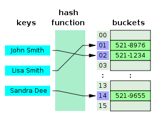
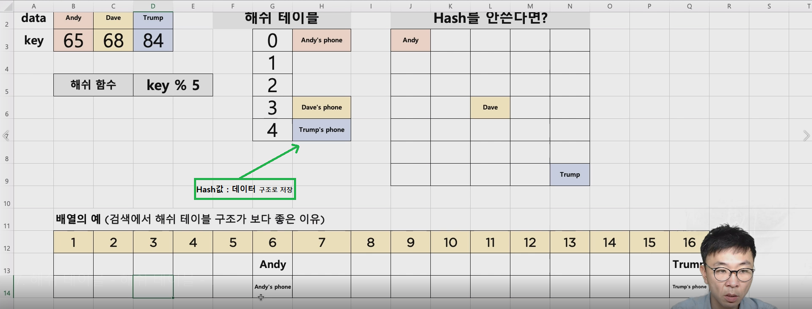

해쉬테이블
-

 
 ---
1. 해쉬 구조
* 키(key)에 데이터(value)를 저장하는 데이터 구조
* key를 통해 바로 데이터를 받아올 수 있으므로, 속도가 획기적으로 빨라짐(키를 연산해서 인덱스로 접근하므로 O(1))
* 파이썬 딕셔너리 타입이 해쉬 테이블의 예시. 
* 보통 배열로 미리 Hash Table 사이즈 만큼 생성 후에 사용 (공간과 탐색 시간을 맞바꾸는 기법) => 키를 해쉬함수로 값을 변환하면 해당 값이 저장 주소가 되어서 바로 알수 있게 만든 구조이다.
* 단, 파이썬에서는 해쉬를 별도 구현할 필요가 없음(딕셔너리 타입을 사용하면 됨)

2. 알아둘 용어
* 해쉬 : 임의 값을 고정 길이로 변환하는 것 (임의의 값을 특정 길이의 값으로 변환하는데, 그 값은 특정 의미를 가짐)
* 해쉬 테이블 : 키 값의 연산에 의해 직접 접근이 가능한 데이터 구조(배열 : 키를 연산해서 얻은 인덱스로 접근이 가능함)
* 해싱 함수 (Hashing Function) : Key 에 대해 산술 연산을 이용해 데이터 위치를 찾을 수 있는 함수 (주소를 찾을 수 있게 만듬, 원리 : 복호화가 안되고, 암호화할 때 같은 값을 암호화 하면 무조건 같은 해쉬 값이 나오는게 이 함수의 특징이다.)
* 해쉬 값(Hash Value) 또는 해쉬 주소(Hash Address) : Key를 해싱함수로 연산해서, 해쉬값을 알아내고, 이를 기반으로 해쉬 테이블에서 해당 key에 대한 데이터 위치를 있게 찾을 수 있음
* 슬롯(Slot) :  한 개의 데이터를 저장할 수 있는 공간
* 저장할 데이터에 대해 key를 추출할 수 있는 별도 함수도 존재할 수 있음


4. 자료 구조 해쉬 테이블의 장단점과 주요 용도   
-- 장점 
 * 데이터 저장/읽기 속도가 빠르다.(검색속도가 빠르다.)
 * 해쉬는 키에 대한 데이터가 있는지(중복) 확인이 쉬움 => 바로 확인이 가능함(인덱스에 값이 있는지 확인만 하면 됨)

-- 단점
 * 일반적으로 저장 공간이 좀더 많이 필요하다. (미리 공간을 잡아두어야 함. 해시 함수를 통해서 나올 수 있는 값의 최대값 만큼 공간을 미리 할당해야함)
 * **여러 키에 해당하는 주소가 동일한 경우 충돌을 해결하기 위한 별도 자료구조가 필요함** => 이 때문에 중복을 해결하기 위한 해시가 즉 성능이 된다. 일반적으로 공간을 많이 잡아 놓음으로서 성능 문제를 해결할 수 있긴함

-- 주요용도
 * 검색이 많이 필요한 경우
 * 저장, 삭제, 읽기가 빈번한 경우
 * 캐쉬 구현시(중복확인이 쉬워서) => url 에 매핑을 함으로써, url 앞에 해당하는 이미지를 저장해둠(자신의 pc에)

6. 충돌(Collision) 해결 알고리즘 (좋은 해쉬 함수 사용하기)
* 해쉬 테이블의 가장 큰 문제는 충돌(Collision)의 경우입니다. 이 문제를 충돌 또는 해쉬 충돌이라고 부릅니다.

6.1 Chaining 기법
 * **개방 해슁 또는 Open Hashing 기법** 중 하나: 해쉬 테이블 저장공간 외의 공간을 활용하는 기법
 * 충돌이 일어나면, 링크드 리스트라는 자료구조를 사용해서, 링크드 리스트로 데이터를 추가로 뒤에 연결시켜서 저장하는 기법
 
```js
충돌 시 해시 테이블 인덱스에 연결 리스트를 이용해서 여러 값을 연결한 형태로 저장한다.

상대적으로 적은 메모리를 사용하나, 해시 함수가 고른 분포를 만들지 못하면 성능에 치명적이다.


이를 테면, key의 hash 값이 한 인덱스에 몰려 모든 value가 연결된다면, 
value를 찾아내는데는 연결 리스트를 모두 탐색해야하므로 최악의 경우 O(n)의 성능을 갖을 수 있다. => 해시함수 구현의 중요성
```
 
6.2 Open addressing 기법 
 * 폐쇄 해슁 또는 Close Hashing 기법 중 하나 : 해쉬 테이블 저장 공간 안에서 충동 문제를 해결하는 기법
 * 충돌이 일어나면, 해당 hash address의 다음 address부터 맨 처음 나오는 빈 공간에 저장하는 기법

```js
값이 없는 공간을 찾아 가서 값을 저장하므로 공간 효율은 나온다.
다만, 비어있지 않은 슬롯을 계속 만나면, 규칙에 따라 빈 곳을 찾아 추가하는데 오래걸린다.

1. Linear Probing(선형 탐색) : 비어있는 인덱스 n개를 후의 비어있는 슬롯에 노드를 저장한다.
2. Quadratic Probing(제곱 탐색) : 충돌이 일어난 인덱스의 제곱을 한 해시에 데이터를 저장한다.
3. Double Hashing(이중 해시) : 다른 해시 함수를 한 번 더 적용한 해시에 데이터를 저장한다

위 탐색 기법은 데이터가 고르게 분포하도록 만드려는 시도들이다. 
그리고, 만약 같은 인덱스에 데이터가 8개 이상 쌓이면 성능을 위해
TREE 구조의 자료형이 대신 들어간다.
```

구현
-
* Chaining 기법으로 충돌 해결한 해쉬테이블
   - [ChainingHashTable.java](./ChainingHashTable.java "ChainingHashTable.java")
* Linear 기법으로 충돌 해결한 해쉬테이블
   - [LinearHashTable.java](./LinearHashTable.java "LinearHashTable.java")


실행
-
[HashTableTest.java](../speedTest/HashTableTest.java "HashTableTest.java")

해시 테이블의 구조
-




**키를 통해서 얻은 해시값**으로 데이터에 접근한다는 것이 핵심

