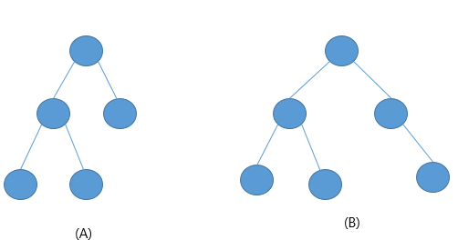

힙(Heap)이란
-
* 힙: 데이터에서 최대값과 최소값을 빠르게 찾기 위해 고안된 완전 이진트리(Complete Binary Tree)
   - 완전이진트리: 노드를 삽입할 때 최하단 왼쪽 노드부터 차례대로 삽입하는 트리

힙을 사용하는 이유
-
* 배열에 데이터를 넣고, 최대값과 최소값을 찾으려면 O(n)이 걸림
* 반면 힙에 데이터를 넣고 최대값과 최소값을 찾으면 O(logn)이 걸림
* 우선순위 큐와 같이 최대값 또는 최소값을 빠르게 찾아야 하는 자료구조 및 알고리즘 구현 등에 활용됨

힙(Heap) 구조
-
* 힙은 최대값을 구하기 위한 구조(Max Heap)와 최소값을 구하기 위한 구조(최소 힙, Min Heap)로 분류할 수 있음
* 힙은 다음과 같이 두 조건을 가지고 있는 자료구조임
* 각 노드의 값은 해당 노드의 자식노드가 가진 값보다 크거나 같다. (Tree 가 좌우로 값을 나누어 구분했다면, Heap은 위 아래로 값을 구분한다.)
   - 최소힙의 경우에는 자식노드의 값보다 작거나 같다.
* 완전 이진 트리이다. 무조건 왼쪽부터 데이터를 채워나가는 구조이다.

이진트리 VS 완전 이진 트리
-

좌측, 완전이진 탐색트리, 우측 이진트리
* **주의할점**은 힙은 이진트리의 한 종류이긴 하나, 이를 구현할 때는 노드가 아닌, 배열을 통해서 구현하고, 그래서 인덱스를 통한 접근이 가능하다.

이진트리의 종류
-

이진트리 삽입 구현
-

1. 먼저 빈자리에 값을 넣은 뒤에 => 완전 이진 트리 조건에 부합하기 위함
2. 노드를 노드의 크기를 비교해서 변경해준다.

* **상위 노드의 인덱스 값 = (인덱스 값 - 1) / 2** 을 이용해서 계산한다.    
* 이 때 java에선 int 타입의 경우 소수점을 버림

이진트리 삭제 구현
-

1. 삭제
2. 가장 마지막에 insert 된 노드를 최상단으로 
3. 가장 좌측 데이터와 비교를 하면서 노드를 교체해줌

구현
-
[Heap.java](./Heap.java "Heap.java")

실행
-
[실행](../speedTest/HeapTest.java "실행")
