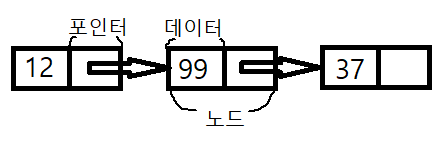

Linkedlist
-
특징&구조
-
* 연결리스트라고도 함 
* 순차적으로 연결된 공간에 데이터를 쌓는 배열과 다르게, 떨어진 공간에 놓인 데이터를 연결(주소를) 해놓은 구조


용어
-
* 노드(Node): 데이터 저장단위(데이터값, 포인터)로  구성
* 포인터(pointer): 각 노드 내부에서 다음 또는 이전 노드의 연결주소 정보를 가진 공간



특징
-
* 첫 주소정보만 알고 있으면 모든 노드에 접근이 가능
* 마지막 노드는 포인터가 비어있는지 여부로 확인 가능

장점
-
* 미리 공간을 할당해 놓지 않아도 됨

단점
-
* 연결을 위한 공간이 별도로 필요하기 때문에 공간 효율이 낮다.
* 삭제를 할 때 앞 뒤 데이터의 연결이 필요 => 구현이 복잡하다.

구현
-
[LinkedList.java](./LinkedList.java "LinkedList.java")

실행
-
[LinkedListTest.java](../speedTest/LinkedListTest.java "LinkedListTest.java")

링크드 리스트 구현 방법
-
```java
public class Node {
    private Object data;
    private Object next;

    public Node(Object data, Object next) {
        this.data = data;
        this.next = next;
    }
    public Node(Object data) {
        this.data = data;
        this.next = null;
    }
}
```
자바로 노드를 구현. 노드에는 주소를 담을 next 변수와 값을 담을 data 변수가 있다.
LinkedList 에는 기본적으로 구현해야할 메소드가 있다.
1. add => 마지막 노드에 다음노드를 연결해준다. 처음에 추가해줄 경우 해더를 변경한다.
2. remove => 인덱스에 해당하는 값을 지우고 이전 노드와 다음 노드를 연결한다. 처음인 경우 헤더를 변경하고 next를 변경한다.
3. get => 인덱스에 해당하는 값을 가져온다. 
4. size => 크기를 가져온다.

```java
public class LinkedList {
    private Node node;
    public LinkedList() {
        if(null == node) {
            node = new Node("");
        }
    }

    private Node node(int k) {
        Node result = this.node;
        // 첫 노드를 기준으로 삼는다
        for (int t=0; t<k; t++) {
            result = (Node)result.next;
        }
        return result;
    }
}
```
첫 번째 노드는 기본 값으로 넣고 주소를 저장하기 위한 공간을 초기화 한다.
그리고 인덱스에 해당하는 노드를 가져오는 메소드를 작성한다.

```java
...
public int size() {
    int result = 0;
    // 첫 노드를 기준으로 삼는다
    Node lastNode = this.node;
    // 첫 노드를 기준 다음이 없을 때까지 찾는다.
    while(lastNode.next != null) {
        result++;
        lastNode = (Node)lastNode.next;
    }
    return result;
}
...
```
사이즈를 가져오는 메소드
```java
...
public void add(Object data) {
    if (this.size() == 0) {
        this.head = new Node(data);
        return;
    }

    Node lastNode = node(this.size()-1);
    Node newNode = new Node(data);
    lastNode.next = newNode;
}
...
```
마지막 노드를 찾아 다음 노드를 이어놓는다.

```java
public void add(int index, Object data) {
    // 해더를 변경하는 작업을 해준다.
    if (index == 0) {
        Node curNode = (Node)this.head;
        this.head = new Node(data);
        this.head.next = curNode;
        return;
    }
    Node prevNode = node(index-1);
    Node nextNode = (Node)prevNode.next;
    Node newNode = new Node(data);
    prevNode.next = newNode;
    newNode.next = nextNode;
}
```
원하는 인덱스에 값을 넣는다.

```java
// 제거
public void remove(int i) {
    if (i < 0) {
        return;
    }
    if (i == 0) {
        Node nextNode = (Node)this.head.next;
        this.head = nextNode;
        return;
    }

    Node target = this.head;    // 제거할 노드
    Node before = null;         // 제거할 노드의 이전 노드
    Node after = null;          // 제거할 노드의 다음 노드

    before = node(i-1);
    //속도 개선을 위해 node 메소드 사용 X
    target = (Node)before.next;
    after = (Node)target.next;

    //마지막
    if (null == after) {
        //메모리 상에서 제거
        target.data = null;
        //이전 주소 데이터 제거
        before.next = null;

    //다음을 이어줘야 하는 경우
    } else {
        before.next = after;
    }
}

public Object get(int i) {
    Node result = this.head;
    // 첫 노드를 제외하고 출력하므로
    for (int t=0; t<i; t++) {
        result = (Node)result.next;
    }
    return result.data;
}
```
remove과 get 메소드 

```java
LinkedList list = new LinkedList();
list.add("1");
list.add("2");
list.add("3");
list.add("4");
System.out.println("============");

for (int i=0; i<list.size(); i++) {
    System.out.println((String)list.get(i));
}
System.out.println("============");

//System.out.println(test.size());
list.remove(0);

list.add(1, "9");
System.out.println("============");

for (int i=0; i<list.size(); i++) {
    System.out.println((String)list.get(i));
}``
```
사용법
```java
    ============
    1
    2
    3
    4
    ============
    ============
    2
    9
    3
    4
```
결과


