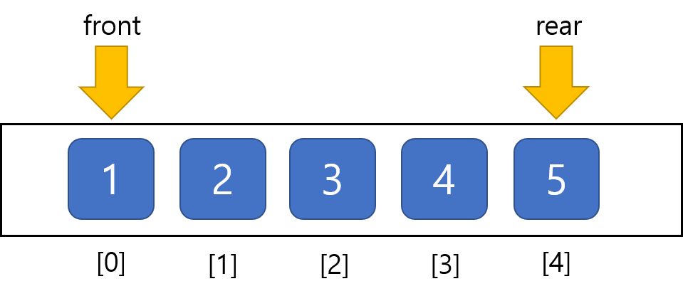

Queue
-
* 컴퓨터나 인터넷에서 정말 많이 사용되는 자료구조
* 따라서 구조&정책&용어에 대해 잘 파악하고 있어야함

용어
-
* Enqueue : 데이터를 큐에 넣는 것
* Dequeue : 큐에서 데이터를 꺼내는 것

정의
-
* FIFO (First In First Out) 구조로 되어 있다.

종류
-
* Queue: 가장 일반적인 큐
* LifoQueue: 나중에 입력된 데이터가 먼저 출력되는 구조 (FILO [First In Last Out] or LIFO [Last In First Out])
* PriorityQueue: 데이터마다 우선순위를 넣어서 우선순위가 높은 순서로 출력되는 구조. 데이터를 넣을 때 우선수위와 함께 넣음

Queue가 많이 사용되는 곳
- 
* 운영체제에서 멀티테스킹을 위해 프로세스 스케줄링 방식을 구현할 때 많이 사용함
* 이벤트 등등을 할 때 많이 사용
List로 Queue를 구현할 때
-
첫번 째에 데이터를 저장하고 맨 뒤의 데이터를 꺼내는 메소드를 구현.

