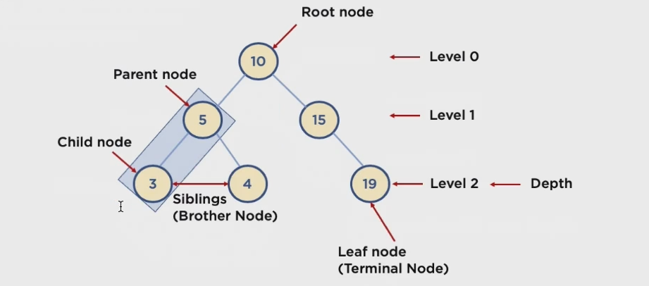

트리
-

## 트리구조
* 트리: Node와 Branch를 이용해서, 사이클을 이루지 않도록 구성한 데이터 구조 (Child 간의 연결이 없음)
* 실제로 사용되는 곳 : 트리의 한 종류로, 이진 트리 (Binary Tree) 형태의 구조로, 탐색(검색) 알고리즘 구현을 위해 많이 사용됨

## 알아둘 용어
* Node: 트리에서 데이터를 저장하는 기본 요소(데이터와 다른 연결된 노드에 대한 Branch 정보를 포함)
* Root Node: 트리 맨 위에 있는 노드
* Level: 최상위 노드를 Level 0 으로 하였을 때, 하위 Branch로 연결된 노드의 깊이를 나타냄
* Parent Node: 어떤 노드의 이전 레벨에 연결된 노드
* Chlid Node: 어떤 노드의 상위 레벨(더 낮은 가지)에 연결된 노드
* Leaf Node(Terminal Node): Child Node가 하나도 없는 노드
* Sibling (Brother Node): 동일한 Parent Node를 가진 노드
* Depth: 트리에서 Mode가 가질 수 있는 최대 Level
* Branch: 노드와 노드 사이의 연결

---
## 이진 트리와 이진 탐색 트리(Binary Search Tree)
* 이진 트리: 노드의 최대 Branch 가 2개인 트리
* 이진 탐색 트리(Binary Search Tree, BST): 이진 트리에 다음과 같은 추가적인 조건이 있는 트리
    - 왼쪽 노드는 해당 노드보다 작은 값, 오른쪽 노드는 해당 노드보다 큰 값을 가진다.

1. 자료 개수가 1개일 때: 1번 비교
2. 자료 개수가 3개일 때: 2번 비교
3. 자료 개수가 7개일 때: 3번 비교
4. 자료 개수가 15개일 때: 4번 비교  
=>   
입력을 N 이라고 할 때, 탐색 회수 X (이것을 시간복잡도로 O(N)이라고 한다.)는  
N = X^2 가 되므로 O(N) = logN 이 된다.  

배열과 비교하면 아래 그림과 같다.

---

## 이진 탐색 트리의 장점과 주요 용도
* 주요 용도: 데이터 검색(탐색)
* 장점: 탐색속도를 개선할 수 있음
* 단점:

## 이진 탐색 트리 주소 메소드
* find
* insert
* delete
    1. Leaf Node 를 삭제하는 경우 => 그냥 삭제
    2. Child Node 가 하나인 경우 => 해당 노드를 삭제하고 **parent 노드가 있던 자리**에 Child 노드를 연결
    3. Child Node 가 두개인 경우 => 삭제할 노드 기준으로 좌측 노드의 자식 중 가장 큰 값이나, 우측 노드의 가장 작은 값을 삭제한 자리로 옮기면 된다. 다만, 그 값 또한 자식 노드가 있을 수 있는데, 그 노드는 옮겨질 노드의 부모 노드 아래쪽으로 옮겨주면 된다.

---
## 시간복잡도
* 트리의 높이(depth)를 h라고 표기한다면, O(h)
* n개의 노드를 가진다면 h = 2logn 에 가까우므로 시간복잡도는 O(logn)
* 한번 실행마다 50%의 탐색 수를 제거할 수 있음. 
* 다만, 데이터가 순차적으로 쌓이는 경우 링크드리스트와 동일한 O(n)의 성능을 보여줌(ArrayList는 검색의 경우 O(n))

구현
-
[Tree.java](./Tree.java "Tree.java")

## 실행
[TreeTest.java](../speedTest/TreeTest.java "TreeTest.java")
---