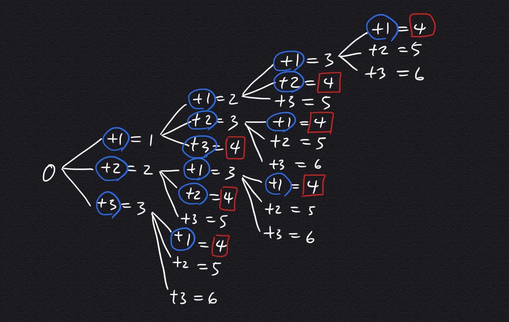

재귀호출(재귀용법) 예제
-

팩토리얼
-
* 2!: 1 x 2
* 3!: 1 x 2 x 3
* 4!: 1 x 2 x 3 x 4

재귀호출의 일반적인 형태
-
```java
함수 (입력값) {
    if (입력값 > 일정값) return 함수(입력값 -1)
    else return 특정값;
}

함수 (입력값) {
    if (입력값 <= 일정값) return 입력값 또는 일정값
    else return 함수(특정값);
}
```

재귀용법을 활용한 프로그래밍 연습
-

팩토리얼
-
```java
public static int factorial_recursive(int n) {
    if (n > 1) {
        return n * factorial_recursive(n - 1);
    } else {
        return 1;
    }
}
```
* 공간 복잡도는 O(n) => n의 크기에 따라 호출되는 함수의 개수가 달라지고 함수 내부에서 사용하는 변수인 n의 개수가 n-1 개 생성 되므로


회문 찾기
-
순서가 거꾸로 되어도 같은 의미를 가지는 단어가 되는 문자를 의미함
회문 예시 : LEVEL 
```java
public static boolean palindrome(String str) {
    if (str.length() <= 1) {
        return true;
    }

    // 양쪽 끝이 동일하면 다음 단계 진행
    if (str.charAt(0) == str.charAt(str.length()-1)) return palindrome(str.substring(1, str.length()-1));
    else return false;
}
```
* 핵심은 입력 받은 문자열의 양 끝을 비교하고 같으면 양끝을 제외한 문자열을 넣은 자신의 함수를 다시 호출하는 것이다.
* 이때 길이가 1이하가 되어버릴 때까지 진행이 된다는 말은 문자열이 완전한 대칭을 이루고 있다는 뜻


정수 n이 주어졌을 때 1,2,3을 더해서 얻어지는 경우의 수를 모두 구하시오  
-
0에서 1,2,3 을 더한 결과에 또 1,2,3 을 더하는 과정을 반복한 결과 얻어지는 값이 n인 케이스를 모두 합치면 되는데 그것은 아래 그림과 같다.



출처 : <https://sihyungyou.github.io/baekjoon-9095//>

이것을 반대로 생각하면, n을 구해야 할경우 지속적으로 1,2,3을 빼서 1,2,3이 나오는 케이스를 구해서 더하면 될 것임
아래 함수는 지속적으로 재귀호출을 하면서 **n에 1,2,3을 빼면서** n이 1,2,3이 되면 호출을 멈출 것이다. 그리고 
```java
public static int subCase(int n) {
    if (n == 1) return 1;       // 주어진 수가 1일 때 1개의 조합수
    else if (n == 2) return 2;  // 주어진 수가 2일 때 2개의 조합수
    else if (n == 3) return 4;  // 주어진 수가 3일 때 4개의 조합수

    // 현재 숫자에서 1을 빼고 2를 빼고 3을 계속 지속적으로 빼서 3,2,1 이 되는 모든 경우를 구함
    return subCase(n-1) + subCase(n-2) + subCase(n-3);
}
```


