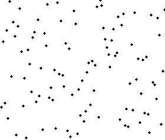

정렬
-

들어가기 전에
-

임의로 배열에 들어갈 값을 추출하는 방법
```java
ArrayList list = new ArrayList<Integer>();
for (int i=0; i<size; i++) {
    int n = (int)(Math.random() * 100) + 1;

    if (!list.contains(n)) {
        list.add(n);
    }
}
for (int i=0; i<list.size(); i++) {
    System.out.print(list.get(i) + ", ");
}
```

출력 결과를 사용해서 배열을 만들고 정렬을 시도하면 됨

---


버블정렬
-
* 가장 먼저 생각해볼 수 있는 알고리즘
* 인접한 두 값을 비교해서 변경해 가며 정렬하는 방법
* 장점 : 구현이 쉽다.
* 단점 : O(n^2) 으로 느린 알고리즘인데다가, 값의 변경이 많아서 느리다. 선택 정렬보다 더 느리다.
* 시간 복잡도 : n * (n-1) / 2 => O(n^2)



선택정렬
-
* 계속 반복해서 리스트를 반복해서 가장 작은 값을 하나 결정하고 그것을 앞에서 부터 정렬해 넣는 방법 (한번 반복할 때 마다, 다음 반복의 범위가 줄어들음)
* 장점 : 메모리가 제한적일 때 성능상의 이점을 가져갈 수 있다.
* 단점 : 시간복잡도가 O(n^2)으로 좋지 못하나 모든 경우에서 버블 정렬보다는 성능이 좋다.
* 시간 복잡도 : n * (n-1) / 2 => O(n^2)


삽입정렬
-
* 정렬하는 범위를 넓혀 가면서 정렬한다. 범위에 들어온 새로운 값을 뒤에서 부터 비교해가며 값을 뒤로 밀어내고, 제자리에 찾아가는 방법이다.
   - 자료 배열의 모든 요소를 앞에서부터 차례대로 이미 정렬된 배열 부분과 비교하여, 자신의 위치를 찾아 삽입함으로써 정렬을 완성하는 알고리즘
* 장점 : 거의 정렬이 되어있는 값을 정렬할 때 상당히 빠르다. (일부 값만을 정렬하므로)
* 단점 : 배열이 길어질수록 효율이 떨어진다
* 시간 복잡도 : n * (n-1) / 2 => O(n)


퀵정렬
-
* 평균 속도가 O(N+logN)
* logN은 굉장히 작은 숫자
    - 2^10 = 대략 1,000 
    - 2^20 = 대략 1,000,000
    - logN 에서 N 이 1,000,000, 일 때 20 정도
* 특정한 값을 기준으로 큰 숫자와 작은 숫자를 서로 교환한 뒤에 나눈 배열을 다시 정렬함
* 이때 특정한 기준으로 피벗(pivot)이라고 부름 
* 보통 가장 앞에 있는 값을 피벗으로 설정 
  
실행
-
[실행](./Sort.java) 

